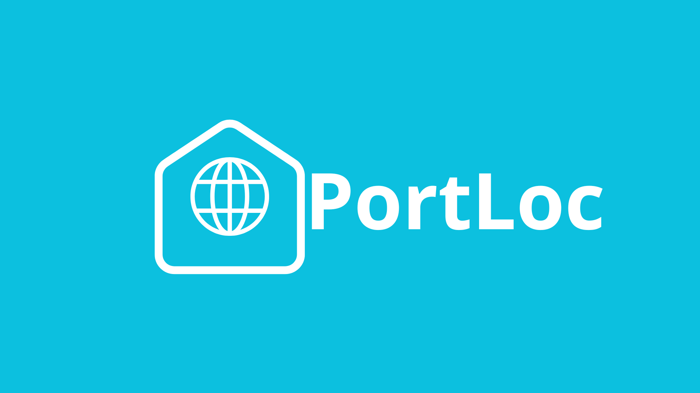
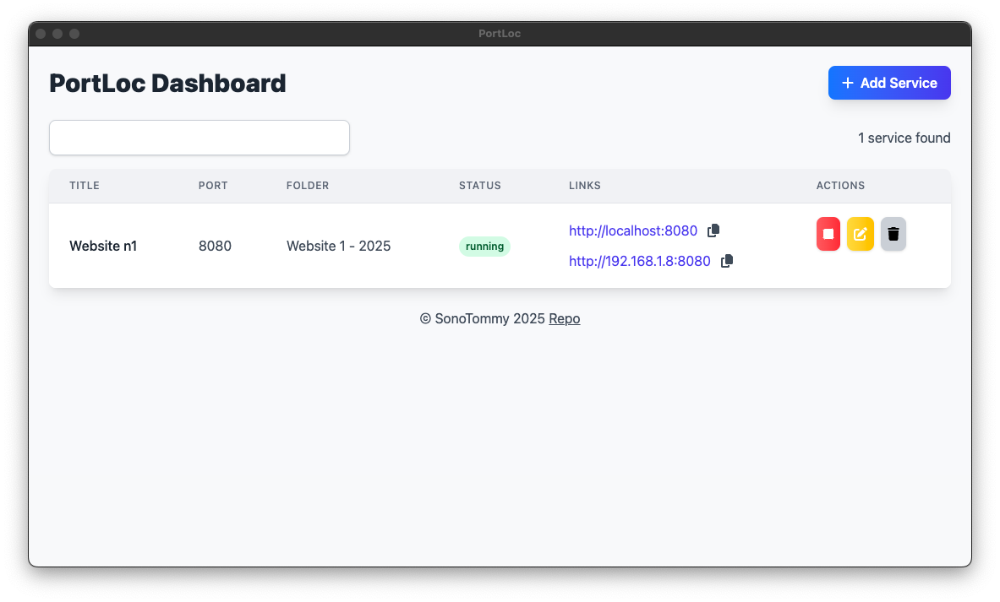
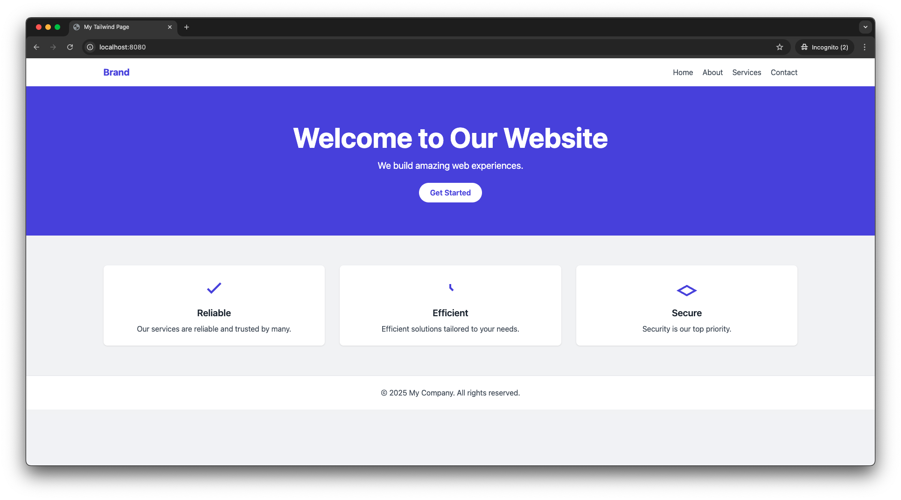

# PortLoc

PortLoc is a small desktop application that lets you easily host and manage local file folders over HTTP.
It creates local HTTP servers on any folder you choose, assigns each server a port, and provides a clean GUI to start, stop, edit, or remove servers.
It remembers your services between launches so you don’t have to reconfigure every time.

🔗 **Official site**: [https://sonotommy.github.io/portloc-site/](https://sonotommy.github.io/portloc-site/)

## Table of Contents

* [Features](#features)
* [Demo](#demo)
* [Installation](#installation)
* [Usage](#usage)
* [Configuration](#configuration)
* [Roadmap](#roadmap)
* [Contributing](#contributing)
* [License](#license)
* [Contact](#contact)

## Features

* **Create servers** on any local folder
* **Assign ports** automatically (e.g. `8080`)
* Quick-access buttons to open or copy:

  * `http://localhost:<PORT>`
  * `http://<YOUR_LOCAL_IP>:<PORT>`
* **Manage** running servers (start / stop / edit / remove) via a friendly GUI
* **Persistence**: remembers your configured services between app launches
* Built with [Vite](https://vitejs.dev/) + [Tailwind CSS](https://tailwindcss.com/)

## Demo




## Installation

```

git clone https://github.com/SonoTommy/PortLoc

cd PortLoc

npm install

npm run start
```

### 🔽 Pre-built Installers

You can download the official pre-built release of **PortLoc 1.0.0** for:

* 🪟 **Windows** (`.exe` installer)
* 🍎 **macOS (ARM - Apple Silicon)**
* 🐧 **Ubuntu (64-bit)**

👉 [**Download PortLoc 1.0.0 from GitHub Releases**](https://github.com/SonoTommy/PortLoc/releases/tag/1.0.0)

> No build required — just download and run!

🌐 **Official website**: [https://sonotommy.github.io/portloc-site/](https://sonotommy.github.io/portloc-site/)

### Prerequisites

* [Node.js](https://nodejs.org/) (>=14)
* [npm](https://www.npmjs.com/) (>=6)

### Clone the repo

```bash
git clone https://github.com/SonoTommy/PortLoc.git
cd PortLoc
```
